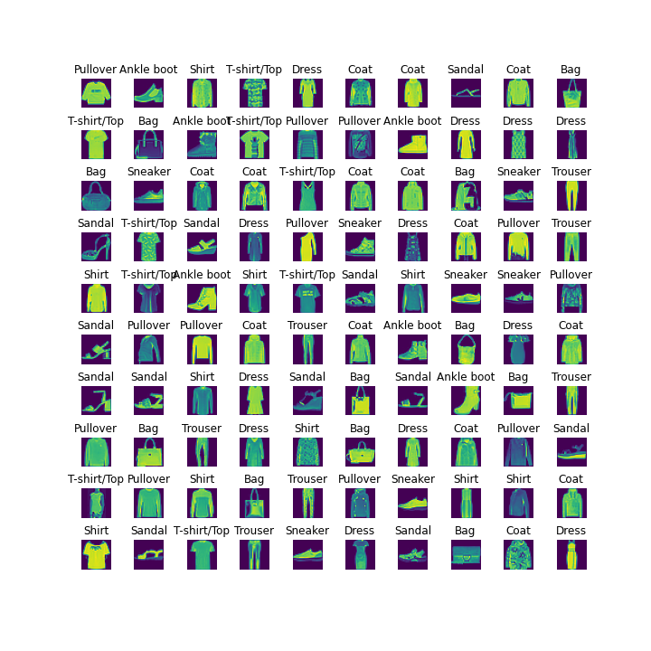

# Homework 10: Supervised Classification 

## Due: April 11th, 2025 11:59pm ET


This homework asks you to fill in portions of code to classify an image dataset using three classifiers from the sklearn library: the KNN, the SVM, and the MLP classifiers.

***IMPORTANT NOTE: In order to avoid multiple copies of the required data, we have shared the data on BrightSpace. 
Please download and unzip the HW10 data from BrightSpace and create a data sub folder. From the course home page on BrightSpace go to 
"Content" -> "HW 10".***
Your *local* code repository should look as follows 
* homework-10-f24-<your_git_id>
   * data
      * train_data.npy
      * train_labels.npy
      * test_data.npy
      * test_labels.npy
   * hw10.py
   * README.md
   * utils.py
   * .gitignore
   * FMNIST.png

        
# Goals

In this assignment you will:
* Get familiar with dealing with image datasets.
* Learn the different stages of image classifications.
* Learn how to use and evaluate some classifiers and tools available in Python's sklearn package.
  
# Background

## Dataset
For this homework, we will be using the FashionMNIST image dataset. Here is a brief description of this dataset from Kaggle [website](https://www.kaggle.com/datasets/zalando-research/fashionmnist):

The Fashion-MNIST dataset consists of 70000 28x28 grayscale images of apparels. There are 60000 training images and 10000 test images.
Here are some sample images from the dataset.



To reduce your code runtime on this homework, we have provided you with the FMNIST subset with  5000 images for training and 1000 images for testing. In order to simplify the analysis, each class label is assigned a unique class index ranging from 0 to 9.
For each of the following tasks, you have to complete the corresponding function definition and return the classification accuracy and confusion matrix using the provided test set.
While accuracy is a good way to quickly evaluate the performance of a classifier, it hides the detail you need to better understand the performance of your 
classification model i.e., its performance in individual classes. Therefore, we use the confusion matrix in addition to accuracy.   
For more details about confusion matrix, please
see [this link](https://en.wikipedia.org/wiki/Confusion_matrix).
 
## K-Nearest Neighbor (KNN)

k-nearest neighbor (kNN) is a classifier that 
requires no assumptions about the data. It looks at the classes of the k-nearest points and 
picks the most frequent one. The choice of the value of k determines how representative your algorithm is. 
Please refer to the class notes for a more elaborate definition. 
You may want to look into [this documentation](https://scikit-learn.org/stable/modules/generated/sklearn.neighbors.KNeighborsClassifier.html) for the homework.

## Support-Vector Machine (SVM)

SVM is a supervised machine learning algorithm which strives to increase the maximum margin hyperplane separating the data classes while training.
Please refer to the class notes for more details. You may want to look into [this documentation](https://scikit-learn.org/stable/modules/generated/sklearn.svm.SVC.html#sklearn.svm.SVC) 
to learn more about its implementation.

## Multi-layer Perceptron (MLP)

MLPs are supervised classification techniques which involve layering of multiple perceptron unit. 
This helps in solving non-linear classification tasks as well as linear classification. Please refer to your class notes for more details. 
You may want to look into [this documentation](https://scikit-learn.org/stable/modules/generated/sklearn.neural_network.MLPClassifier.html) for your code.

# Instructions

## Packages
If you don't have the `scikit-learn` and `scikit-image` packages already installed in your
environment, you can use the following commands to install them:

```
python3 -m pip install --user scikit-learn
python3 -m pip install --user scikit-image
```
> Note: if you're on Windows, just use `pip3 install scikit-learn` and `pip3 install scikit-image`

## Set up your repository for this homework.

The repository should contain the following files:

1. This README.md.
2. `utils.py` which contains a code for you to explore the provided dataset.
3. `hw10.py` which contains functions to be completed for this homework.
4. `data` folder needs to be created, you would need to extract the FMNIST subset from Brightspace there.
5. `.gitignore` file will ignore the contents in the `data` folder in your commit(s). 
You don't have to do change anything in this file, you can use your usual `git` commands and/or interface for pushing your code.

## Homework Problem 0: Exploring your dataset

In this task, we ask you to run the `utils.py` file to visualize some sample images from the filtered FMNIST dataset with 5000 images for training and 1000 for testing dataset. By default, the code will display a 5x5 grid of random images. Explore
your dataset in this way and see what the images look like. You can increase/decrease the number of images displayed as you wish.

**Note: You do not need to submit anything or fill in any code for this task. This is just for your own exploration.**

## Homework Problem 1: Constructing a Confusion Matrix from Classifier Results

While total accuracy can give us an idea of the predictive power for a given classifier, it does not provide a full picture. In particular, when there are multiple classes being predicted, as is the case for the FMNIST dataset, we wish to know how often our model misclassifies one class for another (for example, how often does our FMNIST classifier mistake a sandal for an ankel boot?). To this end, we can construct a [_confusion matrix_](https://en.wikipedia.org/wiki/Confusion_matrix), where each row of the matrix represents the instances in an actual class while each column represents the instances in a predicted class.

The construction of this matrix should be implemented in the `conf_matrix` function in `hw10.py`, which takes as arguments a list of class predictions, the corresponding list of true class labels, and the number of unique classes being predicted and returns the appropriate confusion matrix as a numpy array. **We ask that you not use an external libary like sklearn to create the confusion matrix and code this function manually.**


## Homework Problem 2: Evaluating Classifier Models Using Scikit-learn

In this problem, you will complete the functions `get_model` (which intializes a classifier model object from sklearn) and `get_model_results` (which evaluates the performace of a given model).

**2.1** To complete `get_model`, simply add the lines that initialize classifier model object with the specified model parameters which are given in a list as an argument to the function. The three classifier models we will be using in this homework are KNN, SVM, and MLP (see background section for more details). 

Remember to use the given parameters in the model initialization (i.e., `n_neighbors` should be used in KNN, `random_state` and `probability` should be used in SVM, and `hidden_layer_sizes`, `random_state`, and `activation` should be used in MLP). You can read about these parameters in the link mentioned above in the background section.

 >Sklearn provides a wide variety of out-of-the-box machine learning models that can be applied with relative ease to a wide variety of datasets, saving you the time of building such models from scratch. Further, since the models in these libraries are coded as objects with a common structure via class inheritance, it is also easy to compare multiple models using the same funciton calls (as you will see in 2.2). While it is not required for the homework, feel free to add models to this function (via additional imports and `elif` statements) if you wish to compare how other classifier models and parameters may compare in performance.

**2.2** To complete `get_model_results` you will need to do the following:

1. Create a classifier model (this is done using the `get_model` function).
2. Train the model using the training sets, which are given as a function arguments.
3. Predict the responses for test dataset, which are given as function arguments.
4. Compute model accuracy. You may use `metrics.accuracy_score(...)` from sklearn with documentation linked [here](https://scikit-learn.org/stable/modules/generated/sklearn.metrics.accuracy_score.html).
5. Calculate the confusion matrix from the prediction results on the test data by using the completed function you coded in problem 1. We ask that you not use an external libary like sklearn to create the confusion matrix and code this function manually.
6. Compute the AUROC score for the test data. You may use `metrics.roc_auc_score(...)`, with documentation linked [here](https://scikit-learn.org/stable/modules/generated/sklearn.metrics.roc_auc_score.html). **Note that you will need to call `model.predict_proba(test_data)` (to retrieve the prediction probabilities) and set `multi_class='ovr'` (to specify the one-versus-rest method of evalution for multiclass prediction) as arguments for this function.**

>The AUROC score is another metric for evaluating classifier models that can measure how robust our classifier is in relation to its sensitivity to predicting other class labels (similar to the confusion matrix, but reduced to single scalar value). For more information you may see the sklearn documentation, or this article on the [receiver operating characteristic (ROC)](https://en.wikipedia.org/wiki/Receiver_operating_characteristic).

This function should then return the total accuracy, confusion matrix, and AUROC score for the given classifier model. 
```
1-neighbors result:
Accuracy: 0.802
AUROC Score: 0.8903701493820227
[[ 75.   0.   1.   3.   3.   0.  15.   0.   0.   1.]
 [  0.  83.   1.   5.   0.   0.   0.   0.   0.   0.]
 [  2.   0.  80.   0.  16.   0.  13.   0.   0.   0.]
 [  2.   3.   1.  80.   8.   0.  10.   0.   0.   0.]
 [  1.   0.  16.   8.  63.   0.   8.   0.   0.   0.]
 [  1.   0.   0.   0.   0.  75.   2.  10.   2.   7.]
 [ 19.   1.  13.   3.   5.   0.  57.   0.   2.   0.]
 [  0.   0.   0.   0.   0.   0.   0.  96.   0.   6.]
 [  0.   0.   1.   1.   1.   1.   2.   1.  90.   1.]
 [  0.   0.   0.   0.   0.   1.   0.   1.   0. 103.]]

2-neighbors result:
Accuracy: 0.806
AUROC Score: 0.9306404632252688
[[84.  0.  3.  3.  2.  0.  6.  0.  0.  0.]
 [ 1. 85.  0.  3.  0.  0.  0.  0.  0.  0.]
 [ 5.  0. 91.  0. 10.  0.  5.  0.  0.  0.]
 [ 7.  5.  1. 86.  1.  0.  4.  0.  0.  0.]
 [ 1.  0. 32.  9. 50.  0.  4.  0.  0.  0.]
 [ 1.  0.  1.  1.  0. 85.  0.  5.  1.  3.]
 [24.  1. 21.  1.  8.  0. 43.  0.  2.  0.]
 [ 0.  0.  0.  0.  0.  0.  0. 98.  0.  4.]
 [ 1.  0.  3.  0.  2.  1.  3.  1. 86.  1.]
 [ 0.  0.  0.  0.  0.  1.  0.  6.  0. 98.]]

3-neighbors result:
Accuracy: 0.815
AUROC Score: 0.9454954476236622
[[ 81.   0.   3.   1.   2.   0.  11.   0.   0.   0.]
 [  1.  85.   1.   1.   1.   0.   0.   0.   0.   0.]
 [  3.   1.  84.   0.  15.   0.   8.   0.   0.   0.]
 [  5.   2.   1.  85.   5.   0.   6.   0.   0.   0.]
 [  2.   0.  16.   5.  64.   0.   9.   0.   0.   0.]
 [  1.   0.   1.   0.   0.  76.   1.  13.   2.   3.]
 [ 20.   1.  15.   1.   5.   0.  55.   0.   3.   0.]
 [  0.   0.   0.   0.   0.   0.   0.  97.   0.   5.]
 [  1.   0.   3.   0.   1.   1.   3.   1.  87.   1.]
 [  0.   0.   0.   0.   0.   0.   0.   4.   0. 101.]]

4-neighbors result:
Accuracy: 0.814
AUROC Score: 0.9535589500049835
[[ 87.   0.   3.   1.   2.   0.   5.   0.   0.   0.]
 [  1.  84.   1.   2.   1.   0.   0.   0.   0.   0.]
 [  3.   0.  85.   0.  16.   0.   7.   0.   0.   0.]
 [  4.   2.   2.  86.   5.   0.   5.   0.   0.   0.]
 [  1.   0.  21.   7.  57.   0.  10.   0.   0.   0.]
 [  0.   0.   0.   0.   0.  76.   3.  13.   1.   4.]
 [ 21.   0.  17.   1.   4.   0.  54.   0.   3.   0.]
 [  0.   0.   0.   0.   0.   0.   0.  99.   0.   3.]
 [  0.   0.   2.   0.   0.   1.   7.   1.  86.   1.]
 [  0.   0.   0.   0.   0.   0.   0.   5.   0. 100.]]

5-neighbors result:
Accuracy: 0.811
AUROC Score: 0.9586000624655426
[[ 80.   0.   4.   3.   1.   0.  10.   0.   0.   0.]
 [  0.  85.   1.   3.   0.   0.   0.   0.   0.   0.]
 [  3.   0.  83.   0.  17.   0.   8.   0.   0.   0.]
 [  4.   2.   1.  88.   5.   0.   4.   0.   0.   0.]
 [  1.   0.  21.   6.  61.   0.   7.   0.   0.   0.]
 [  1.   0.   0.   0.   0.  78.   1.  13.   1.   3.]
 [ 21.   1.  17.   1.   5.   0.  52.   0.   3.   0.]
 [  0.   0.   0.   0.   0.   0.   0.  96.   0.   6.]
 [  0.   0.   2.   0.   1.   1.   5.   2.  86.   1.]
 [  0.   0.   0.   0.   0.   0.   0.   3.   0. 102.]]

SVM Result
Accuracy: 0.845
AUROC Score: 0.987231866899325
[[ 77.   0.   4.  10.   0.   0.   7.   0.   0.   0.]
 [  0.  85.   1.   3.   0.   0.   0.   0.   0.   0.]
 [  2.   0.  82.   0.  16.   0.  11.   0.   0.   0.]
 [  2.   0.   0.  97.   2.   0.   3.   0.   0.   0.]
 [  0.   0.  11.   5.  70.   0.  10.   0.   0.   0.]
 [  0.   0.   0.   0.   0.  87.   0.   7.   2.   1.]
 [ 14.   0.  10.   5.   7.   0.  61.   0.   3.   0.]
 [  0.   0.   0.   0.   0.   2.   0.  92.   0.   8.]
 [  0.   0.   1.   0.   0.   1.   2.   0.  93.   1.]
 [  0.   0.   0.   0.   0.   1.   0.   3.   0. 101.]]

MLP Result
Accuracy: 0.823
AUROC Score: 0.9818025978407865
[[ 74.   0.   4.   4.   0.   0.  16.   0.   0.   0.]
 [  1.  85.   0.   2.   1.   0.   0.   0.   0.   0.]
 [  3.   0.  86.   1.   8.   1.  12.   0.   0.   0.]
 [  2.   0.   0.  93.   2.   0.   7.   0.   0.   0.]
 [  1.   0.  24.   4.  56.   0.  11.   0.   0.   0.]
 [  0.   0.   0.   0.   0.  82.   0.  10.   0.   5.]
 [ 12.   1.  17.   1.   3.   0.  62.   0.   3.   1.]
 [  0.   0.   0.   0.   0.   1.   0.  96.   0.   5.]
 [  2.   0.   2.   0.   1.   0.   1.   3.  88.   1.]
 [  0.   0.   0.   0.   0.   2.   0.   1.   1. 101.]]
```
If you encounter a warning in running the code but obtain the expected results you may ignore the warning.
# Steps to submit your work

Push your completed version of `hw10.py`. **DO NOT** push the dataset you downloaded from brightspace.

